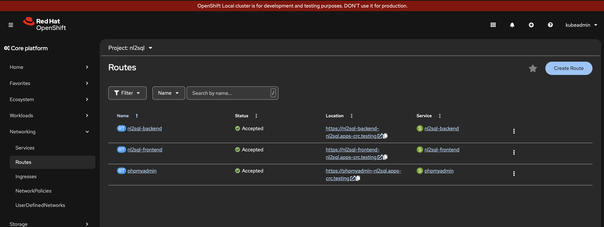
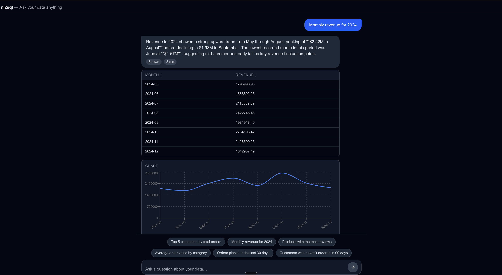
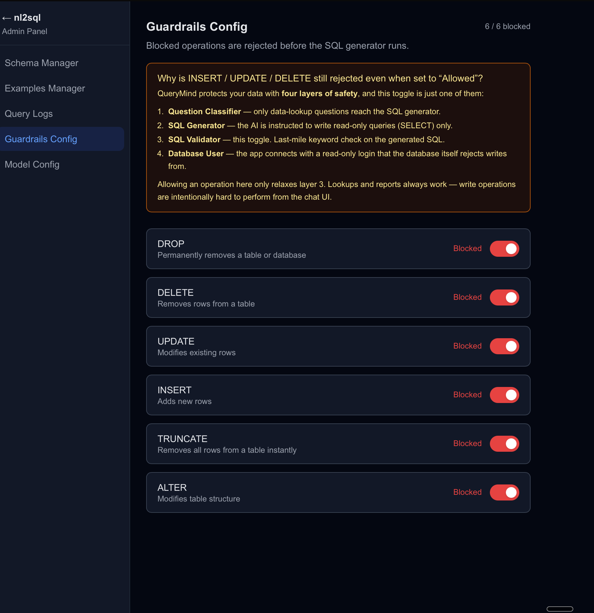
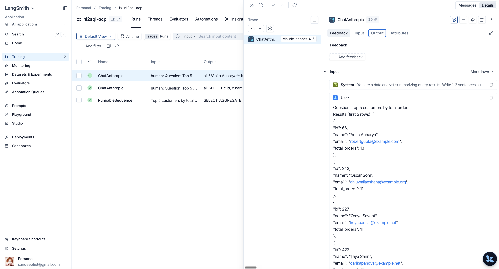
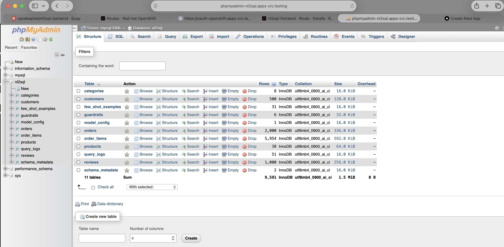

### How to deploy application on OpenShift:- 

### Prerequisites

1. An OpenShift cluster (CRC, ROSA, ARO, or self-managed) with oc CLI logged in              
2. Cluster-admin or namespace-admin permissions (needed to apply SCCs for phpMyAdmin)        
3. An Anthropic API key  

### Clone the repo                   
 git clone https://github.com/sandeeptiet/nl2sql.git
 cd nl2sql
 git checkout feature/openshift
 cd deployment/k8s and create secret.yaml file as per your details.

### Login to OpenShift Container Plateform, and deploy MySQL + Backend + Frontend 
oc apply -k deployment/k8s/  

### Wait for all the pods to be in running state. 
oc get pods -n nl2sql -w

### Run the one-shot seed job to create schema and insert some data into the database. It's idempotent — safe to re-run.
oc apply -f deployment/k8s/jobs/seed-job.yaml -n nl2sql

### Verify that the job has completed successfully. 
oc get pods -n nl2sql -l job-name=nl2sql-seed
oc logs job/nl2sql-seed -n nl2sql

## Steps to access the application:- 

1. Login to OpenShift Container Plateform and navigate to Networking section, then to Routes.

2. Click on the Route URL to open the application. Click on the Frontend application location link. 

3. It will open the application in a new tab. As shown in the screenshot.

4. Screenshot of the Frontend application. Now you can ask your queries in natural language. or simply click on one of the example queries to see the result. The LLM API will generate the SQL query and execute it on the database.

5. Screenshot of the Admin Panel -> Guardrails section of the application. 

6. Screenshot of the Langsmith tracing for the application.

### Optional: Access phpMyAdmin UI to see the schema and data. 

