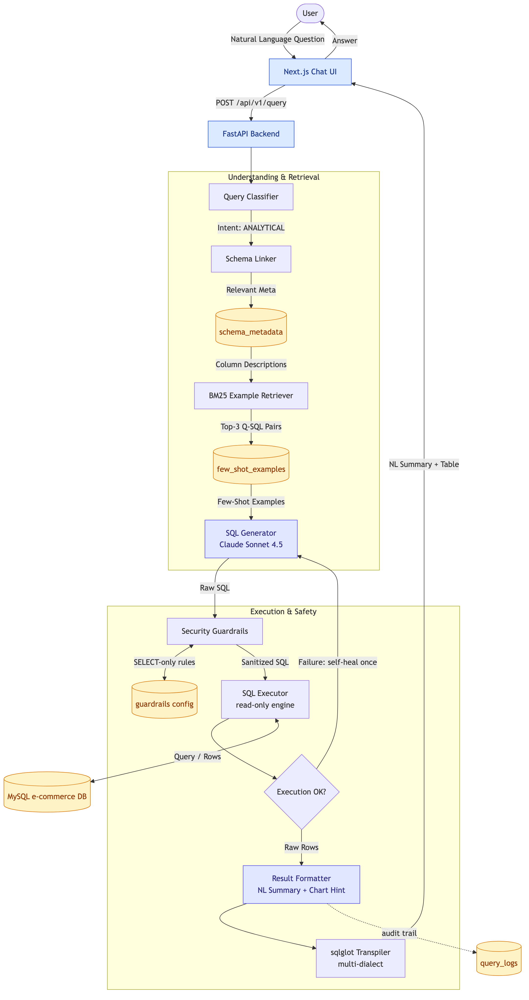

# nl2sql — Natural Language to SQL Analytics Engine

A production-style Text-to-SQL agent for an e-commerce MySQL database. Users ask questions in plain English; the backend runs them through a 7-stage LLM pipeline and returns a result table, a 1-2 sentence natural-language summary, and an optional chart hint. Containerized and deployable to OpenShift / Kubernetes.

---

## Table of Contents

- [Highlights](#highlights)
- [Architecture](#architecture)
- [Tech Stack](#tech-stack)
- [Pipeline — How a Question Becomes an Answer](#pipeline--how-a-question-becomes-an-answer)
- [Defense in Depth — 4 Layers of SQL Safety](#defense-in-depth--4-layers-of-sql-safety)
- [Admin Console — Teaching the LLM](#admin-console--teaching-the-llm)
- [Repository Layout](#repository-layout)
- [Local Development](#local-development)
- [Deploy to OpenShift](#deploy-to-openshift)
- [Screenshots](#screenshots)
- [Evaluation Harness](#evaluation-harness)

---

## Highlights

- **7-stage LLM pipeline** with typed Pydantic contracts between stages (Classify → SchemaLink → Retrieve → Generate → Validate → Execute → Format).
- **Self-healing retry** — on execution failure, the error + failing SQL are re-prompted to Claude for a one-shot correction.
- **Defense in depth** — 4 independent layers prevent destructive SQL (intent classifier, system prompt, keyword validator, read-only DB user).
- **Multi-dialect output** — generation always targets MySQL; `sqlglot` transpiles to PostgreSQL / T-SQL for display.
- **Admin "teaching" surfaces** — schema metadata, few-shot examples, and guardrails are all editable through a UI and feed straight back into the prompt.
- **Cloud-native** — runs on OpenShift CRC under an arbitrary UID; pure-Python retrieval (BM25) and a CRC-safe MySQL driver avoid SIGILLs from `cryptography._rust` / PyTorch on Apple Hypervisor.
- **Evaluation harness** — 25 golden queries with column-agnostic result matching, reported as Markdown.

---

## Architecture



The Mermaid source for this diagram lives at [`docs/architecture.mmd`](docs/architecture.mmd). Re-render with:

```bash
npx -y -p @mermaid-js/mermaid-cli mmdc -i docs/architecture.mmd -o docs/architecture.png -b white --scale 2
```

---

## Tech Stack

| Layer       | Choice                                                  |
| ----------- | ------------------------------------------------------- |
| Frontend    | Next.js 15 (App Router) · React · Tailwind v4           |
| Backend     | FastAPI · Python 3.12 · `uv` for dependency management  |
| LLM         | Anthropic Claude Sonnet 4.5                             |
| Retrieval   | BM25 (`rank_bm25`) over curated Q→SQL pairs             |
| Database    | MySQL 8 · two SQLAlchemy engines (RW + read-only)       |
| SQL parsing | `sqlglot` for validation + multi-dialect transpilation  |
| Tracing     | LangSmith                                               |
| Container   | Podman · Quay.io                                        |
| Orchestrator| OpenShift / Kubernetes (Kustomize)                      |

---

## Pipeline — How a Question Becomes an Answer

Every HTTP request flows through `backend/app/api/routes/query.py`. Each stage is a pure function with typed Pydantic input/output.

| # | Stage          | What it does                                                                 |
| - | -------------- | ---------------------------------------------------------------------------- |
| 1 | **Classify**   | Tags the question as `ANALYTICAL`, `UNSUPPORTED`, etc. Non-SELECT intents are short-circuited here. |
| 2 | **SchemaLink** | Picks only the tables relevant to the question — keeps the prompt small.    |
| 3 | **Retrieve**   | BM25 lookup of the 3 most similar Q→SQL pairs from the `few_shot_examples` table. |
| 4 | **Generate**   | Claude produces MySQL `SELECT` using schema + examples + system prompt.      |
| 5 | **Validate**   | Keyword guardrails (DROP / DELETE / UPDATE / etc.) — admin-configurable.     |
| 6 | **Execute**    | Runs against a **read-only** SQLAlchemy engine. On failure, retries **once** with the error re-injected into the prompt. |
| 7 | **Format**     | Claude writes a 1-2 sentence NL summary, suggests a chart type, and `sqlglot` optionally transpiles the SQL to a non-MySQL dialect for display. |

Every query and its outcome is appended to `query_logs` for audit.

---

## Defense in Depth — 4 Layers of SQL Safety

Each layer is independent. Disabling any one of them does not unlock destructive SQL.

1. **Classifier** — non-SELECT intents return `UNSUPPORTED` before any SQL is generated.
2. **Generator prompt** — the system prompt is `SELECT`-only with explicit refusal rules.
3. **Validator (Guardrails)** — keyword-level deny list, editable from the admin UI.
4. **Read-only DB user** — the executor uses a MySQL account with `SELECT` privileges only.

> Toggling a guardrail in the admin UI only relaxes layer 3; layers 1, 2, and 4 still block writes.

---

## Admin Console — Teaching the LLM

Three editable surfaces shape the prompt at request time:

| Panel             | Backing table        | Prompt effect                                                  |
| ----------------- | -------------------- | -------------------------------------------------------------- |
| Schema Manager    | `schema_metadata`    | Per-column descriptions and PII flags injected into the prompt |
| Examples Manager  | `few_shot_examples`  | Top-3 BM25 matches added as few-shot context                   |
| Guardrails Config | `guardrails`         | Keyword deny list applied by the Validator                     |

Plus two read-only surfaces: **Query Logs** (full audit trail) and **Model Config** (target dialect for the UI).

---

## Repository Layout

```
nl2sql/
├── backend/                # FastAPI + 7-stage pipeline
│   ├── app/api/routes/     # query.py is the orchestrator
│   ├── app/services/       # one module per pipeline stage
│   ├── app/models/         # Pydantic schemas
│   └── Containerfile
├── frontend/               # Next.js 15 (App Router)
│   ├── app/                # chat UI + admin panels
│   └── Containerfile
├── database/               # seed scripts (schema, data, examples)
├── deployment/k8s/         # Kustomize manifests + seed Job
├── docs/
│   ├── architecture.mmd    # source for the diagram above
│   └── architecture.png
├── evaluation/eval.py      # 25-query golden eval harness
└── CLAUDE.md               # design rationale, gotchas, contributor notes
```

---

## Local Development

**Backend** (Python 3.12 + [uv](https://github.com/astral-sh/uv)):

```bash
uv sync
cd backend && uv run uvicorn main:app --reload --port 8000
```

**Frontend** (Node 20):

```bash
cd frontend
npm install
npm run dev          # http://localhost:3000
```

**Seed the database** (only needed the first time, or after a wipe):

```bash
uv run python database/seed_db.py
uv run python database/seed_examples.py --force
```

---

## Deploy to OpenShift

### Prerequisites

- An OpenShift cluster (CRC, ROSA, ARO, or self-managed) with `oc` CLI logged in.
- Cluster-admin or namespace-admin permissions (needed for phpMyAdmin SCCs).
- An Anthropic API key.

### 1. Clone and switch to the container branch

```bash
git clone https://github.com/sandeeptiet/nl2sql.git
cd nl2sql
git checkout feature/openshift
```

### 2. Create the secret from your local `.env.local`

```bash
oc create secret generic nl2sql-secret \
  --from-env-file=backend/.env.local -n nl2sql
```

> `deployment/k8s/secret.yaml` is **gitignored**; `secret.example.yaml` is the template.

### 3. Deploy MySQL + Backend + Frontend

```bash
oc apply -k deployment/k8s/
oc get pods -n nl2sql -w     # wait for Running
```

### 4. Seed the database (idempotent)

```bash
oc apply -f deployment/k8s/jobs/seed-job.yaml -n nl2sql
oc logs job/nl2sql-seed -n nl2sql
```

### 5. Open the app

Navigate to **Networking → Routes** in the OpenShift console and click the frontend route.

---

## Screenshots

**Frontend route in the OpenShift console**


**Chat UI — ask a question in natural language**


**Admin → Guardrails configuration**


**LangSmith trace — full pipeline visibility**


**Optional: phpMyAdmin to inspect schema and data**


---

## Evaluation Harness

`evaluation/eval.py` runs 25 golden queries against the deployed backend and writes a Markdown report.

```bash
# After port-forwarding both services from OpenShift:
oc port-forward service/nl2sql-backend 8000:8000 -n nl2sql &
oc port-forward service/mysql 3306:3306 -n nl2sql &

uv run python evaluation/eval.py --api http://localhost:8000 --report
```

The harness deliberately uses **column-agnostic frozenset matching** with 2-decimal rounding and `T`→space datetime normalization — the LLM often returns extra columns, so exact tuple matching would under-report accuracy. Use `--verbose` to see generated SQL and the first-row diff for failures.

---

## Engineering Notes

For design rationale, OpenShift-specific quirks (CRC SIGILL, arbitrary UID, build-time `BACKEND_URL`), and contributor guidance, see [`CLAUDE.md`](CLAUDE.md) and [`docs/assignment_review.md`](docs/assignment_review.md).
