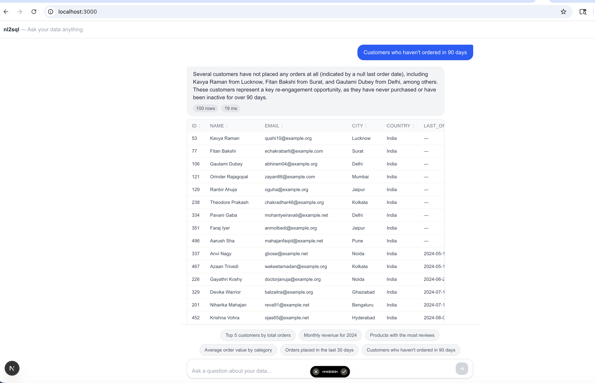
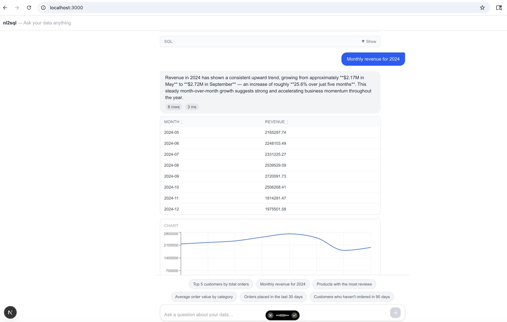
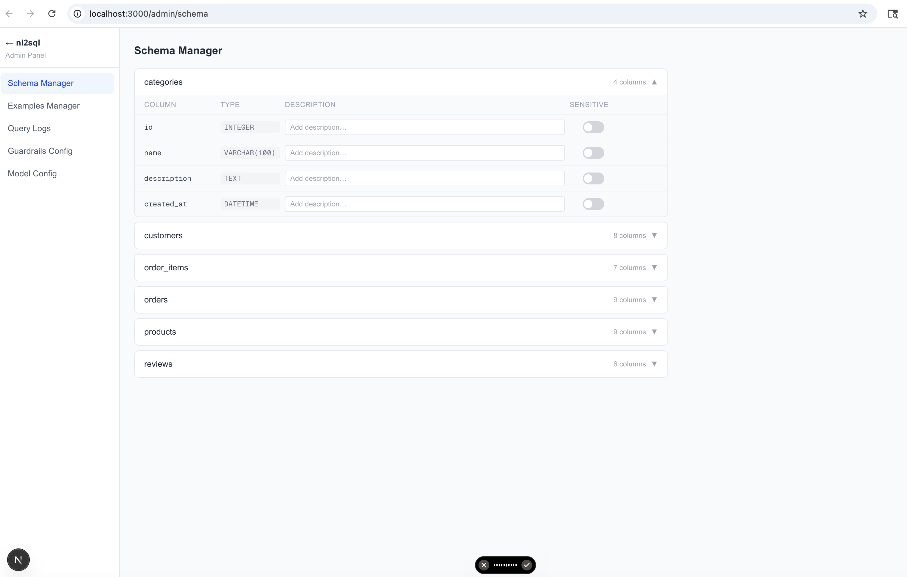

Steps to execute: -
cd backend
sandeepkapoor@Sandeeps-MacBook-Air backend % uv run uvicorn main:app --reload --port 8000

sandeepkapoor@Sandeeps-MacBook-Air frontend % npm run dev

In chrome: http://localhost:3000/



Admin panel URL: http://localhost:3000/admin




finally in nl2sql folder run this command:

sandeepkapoor@Sandeeps-MacBook-Air nl2sql % uv run python evaluation/eval.py --report

Output: - 
nl2sql Evaluation — 2026-05-06 14:27
API: http://localhost:8000/api/v1/query
========================================================================
  [S1] ✓      Which products are currently in stock?  (rows=33)
  [S2] ✗      Show all processing orders  (api=100 gold=100)
         Generated: SELECT id, customer_id, total, created_at FROM orders WHERE status = 'processing' LIMIT 100
         API row 0:    frozenset({'5', '421', '74185.54', '2024-05-10T02:37:26'})
         Golden row 0: frozenset({'5', '421', '74185.54', '2024-05-10 02:37:26'})
  [S3] ✓      List all product categories  (rows=8)
  [S4] ✗      Show products priced above 5000  (api=7 gold=7)
         Generated: SELECT p.id, p.name, p.price, p.stock, p.is_active FROM products p WHERE p.price > 5000 ORDER BY p.price DESC LIMIT 100
         API row 0:    frozenset({'15', '424', 'Godrej Refrigerator', '1', '30101.26'})
         Golden row 0: frozenset({'5379.64', '17', 'IKEA Study Table'})
  [S5] ✗      List all 1-star reviews  (api=59 gold=59)
         Generated: SELECT id, product_id, customer_id, comment, created_at FROM reviews WHERE rating = 1 LIMIT 100
         API row 0:    frozenset({'', '32', '332', '4', '2025-05-08T15:26:57'})
         Golden row 0: frozenset({'', '2025-05-08 15:26:57', '32', '332', '4'})
  [S6] ✗      Show all delivered orders  (api=100 gold=100)
         Generated: SELECT id, customer_id, total, created_at, delivered_at FROM orders WHERE status = 'delivered' LIMIT 100
         API row 0:    frozenset({'2024-05-31T11:56:31', '3129.08', '1', '2024-05-26T11:56:31', '342'})
         Golden row 0: frozenset({'2024-05-31 11:56:31', '3129.08', '1', '342'})
  [A1] ✓      How many total customers are there?  (rows=1)
  [A2] ✓      What is the total revenue?  (rows=1)
  [A3] ✗      What is the average order value?  (api=1 gold=1)
         Generated: SELECT AVG(total) AS avg_order_value FROM orders WHERE status != 'cancelled' LIMIT 100
         API row 0:    frozenset({'26104.983721'})
         Golden row 0: frozenset({'26104.98'})
  [A4] ✓      How many orders per status?  (rows=5)
  [A5] ✓      What is the average product rating?  (rows=1)
  [A6] ✓      What is the most expensive product?  (rows=1)
  [J1] ✗      Show all orders with customer details  (api=100 gold=100)
         Generated: SELECT o.id AS order_id, c.name AS customer_name, c.email, c.city, c.state, c.country, o.status, o.total, o.shipping_cha
         API row 0:    frozenset({'shipped', '', '2026-05-06T06:47:32', '494.53', '80.00', '3321.91', 'oni30@example.com', 'Punjab', 'Riya Oommen', '1888', 'India', 'Chandigarh'})
         Golden row 0: frozenset({'shipped', '2026-05-06 06:47:32', '3321.91', 'oni30@example.com', '1888', 'Riya Oommen'})
  [J2] ✗      List all products with their category  (api=38 gold=38)
         Generated: SELECT p.id, p.name AS product_name, p.description, p.price, p.stock, p.is_active, c.name AS category_name, c.descriptio
         API row 0:    frozenset({'Sit cupiditate delectus ipsam eum sed nostrum pariatur rem esse adipisci similique aliquam.', '1', 'iPhone 15', '12', '4238.37', 'Electronics', 'Phones, laptops, gadgets and accessories'})
         Golden row 0: frozenset({'Electronics', 'iPhone 15', '4238.37'})
  [J3] ✗      Top 5 customers by total spending  (api=5 gold=5)
         Generated: SELECT c.id, c.name, c.email, SUM(o.total) AS total_spent FROM customers c JOIN orders o ON c.id = o.customer_id WHERE o
         API row 0:    frozenset({'indrajitkhalsa@example.net', '447110.09', 'Manthan Sahni', '152'})
         Golden row 0: frozenset({'indrajitkhalsa@example.net', '447110.09', 'Manthan Sahni'})
  [J4] ✗      Find customers with no orders  (api=9 gold=9)
         Generated: SELECT c.id, c.name, c.email, c.city, c.country, c.created_at FROM customers c LEFT JOIN orders o ON c.id = o.customer_i
         API row 0:    frozenset({'Delhi', 'Gautami Dubey', '106', '2026-02-27T02:17:09', 'India', 'abhiram04@example.org'})
         Golden row 0: frozenset({'53', 'Kavya Raman', 'qushi10@example.org'})
  [J5] ✗      Top 5 products by units sold  (api=5 gold=5)
         Generated: SELECT p.id, p.name, SUM(oi.quantity) AS total_units_sold FROM products p JOIN order_items oi ON p.id = oi.product_id GR
         API row 0:    frozenset({'Zara Summer Dress', '11', '531'})
         Golden row 0: frozenset({'531.00', 'Zara Summer Dress'})
  [J6] ✗      Revenue breakdown by product category  (api=8 gold=8)
         Generated: SELECT c.name AS category, COUNT(oi.id) AS total_items_sold, SUM(oi.quantity) AS total_quantity, SUM(oi.subtotal) AS tot
         API row 0:    frozenset({'854', '16651765.47', '2102', 'Home & Kitchen', '7991.67'})
         Golden row 0: frozenset({'Home & Kitchen', '16651765.47'})
  [J7] ✗      Show reviews with customer and product names  (api=100 gold=100)
         Generated: SELECT r.id, c.name AS customer_name, p.name AS product_name, r.rating, r.comment, r.created_at FROM reviews r JOIN cust
         API row 0:    frozenset({'', 'Ishwar Dada', '2026-05-05T23:17:35', '5', '95', 'Milton Water Bottle'})
         Golden row 0: frozenset({'2025-07-06 18:38:33', 'iPhone 15', 'Omya Mitter', '5'})
  [T1] ✗      What orders were placed in the last month?  (api=81 gold=81)
         Generated: SELECT o.id, o.customer_id, c.name AS customer_name, o.status, o.total, o.shipping_charge, o.tax, o.created_at FROM orde
         API row 0:    frozenset({'208', 'shipped', '494.53', '80.00', '3321.91', '1888', '2026-05-06T06:47:32', 'Riya Oommen'})
         Golden row 0: frozenset({'shipped', '2026-05-06 06:47:32', '3321.91', '1888'})
  [T2] ✓      Show monthly revenue for the past year  (rows=13)
  [T3] ✓      How many new customers signed up this month?  (rows=1)
  [T4] ✗      Orders from the past week that were delivered  (api=7 gold=17)
         Generated: SELECT o.id, c.name AS customer, o.total, o.shipping_charge, o.tax, o.delivered_at FROM orders o JOIN customers c ON o.c
  [T5] ✓      How many orders were placed each month in 2024?  (rows=8)
  [T6] ✗      Show customers who joined in the last 3 months  (api=55 gold=55)
         Generated: SELECT c.id, c.name, c.email, c.city, c.state, c.country, c.created_at FROM customers c WHERE c.created_at >= DATE_SUB(N
         API row 0:    frozenset({'kothariamol@example.net', '2026-05-06T02:54:18', 'Jaipur', 'Rajasthan', 'Rayaan Dara', 'India', '373'})
         Golden row 0: frozenset({'2026-05-06 02:54:18', '373', 'Rayaan Dara', 'kothariamol@example.net'})

========================================================================
Type                       EX    EX%       EM    EM%
--------------------------------------------------
  SELECT_SIMPLE          2/6   33.3%     0/6    0.0%
  SELECT_AGGREGATE       5/6   83.3%     0/6    0.0%
  SELECT_JOIN            0/7    0.0%     0/7    0.0%
  SELECT_TEMPORAL        3/6   50.0%     0/6    0.0%
--------------------------------------------------
  TOTAL                 10/25   40.0%     0/25    0.0%

  Execution Accuracy: 40.0%  — target ≥50.0%  [FAIL]

  Report written to docs/eval_report.md
sandeepkapoor@Sandeeps-MacBook-Air nl2sql % uv run python evaluation/eval.py --report

nl2sql Evaluation — 2026-05-06 14:45
API: http://localhost:8000/api/v1/query
========================================================================
  [S1] ✓      Which products are currently in stock?  (rows=33)
  [S2] ✓      Show all processing orders  (rows=100)
  [S3] ✓      List all product categories  (rows=8)
  [S4] ✓      Show products priced above 5000  (rows=7)
  [S5] ✓      List all 1-star reviews  (rows=59)
  [S6] ✓      Show all delivered orders  (rows=100)
  [A1] ✓      How many total customers are there?  (rows=1)
  [A2] ✓      What is the total revenue?  (rows=1)
  [A3] ✗      What is the average order value?  (api=1 gold=1)
         Generated: SELECT AVG(total) AS avg_order_value FROM orders WHERE status != 'cancelled' LIMIT 100
         API row 0:    frozenset({'26104.983721'})
         Golden row 0: frozenset({'26104.98'})
  [A4] ✓      How many orders per status?  (rows=5)
  [A5] ✓      What is the average product rating?  (rows=1)
  [A6] ✓      What is the most expensive product?  (rows=1)
  [J1] ✓      Show all orders with customer details  (rows=100)
  [J2] ✓      List all products with their category  (rows=38)
  [J3] ✓      Top 5 customers by total spending  (rows=5)
  [J4] ✓      Find customers with no orders  (rows=9)
  [J5] ✗      Top 5 products by units sold  (api=5 gold=5)
         Generated: SELECT p.id, p.name, SUM(oi.quantity) AS total_units_sold FROM products p JOIN order_items oi ON p.id = oi.product_id GR
         API row 0:    frozenset({'531', 'Zara Summer Dress', '11'})
         Golden row 0: frozenset({'Zara Summer Dress', '531.00'})
  [J6] ✓      Revenue breakdown by product category  (rows=8)
  [J7] ✗      Show reviews with customer and product names  (api=100 gold=100)
         Generated: SELECT r.id, c.name AS customer_name, p.name AS product_name, r.rating, r.comment, r.created_at FROM reviews r JOIN cust
         API row 0:    frozenset({'', 'Milton Water Bottle', '2026-05-05 23:17:35', 'Ishwar Dada', '95', '5'})
         Golden row 0: frozenset({'iPhone 15', '2025-07-06 18:38:33', 'Omya Mitter', '5'})
  [T1] ✓      What orders were placed in the last month?  (rows=81)
  [T2] API error: HTTPConnectionPool(host='localhost', port=8000): Read timed out. (read timeout=30)
  [T3] API error: HTTPConnectionPool(host='localhost', port=8000): Read timed out. (read timeout=30)
  [T4] API error: HTTPConnectionPool(host='localhost', port=8000): Read timed out. (read timeout=30)
  [T5] API error: HTTPConnectionPool(host='localhost', port=8000): Read timed out. (read timeout=30)
  [T6] API error: HTTPConnectionPool(host='localhost', port=8000): Read timed out. (read timeout=30)

========================================================================
Type                       EX    EX%       EM    EM%
--------------------------------------------------
  SELECT_SIMPLE          6/6  100.0%     0/6    0.0%
  SELECT_AGGREGATE       5/6   83.3%     0/6    0.0%
  SELECT_JOIN            5/7   71.4%     0/7    0.0%
  SELECT_TEMPORAL        1/6   16.7%     0/6    0.0%
--------------------------------------------------
  TOTAL                 17/25   68.0%     0/25    0.0%

 # Execution Accuracy: 68.0%  — target ≥50.0%  [PASS] 

  Report written to docs/eval_report.md


# nl2sql — Natural Language to SQL Analytics Engine

Ask plain-English questions about an e-commerce database. Claude Sonnet generates the SQL, executes it, and returns a summary, sortable table, auto chart, and the SQL itself.

---

## Tech Stack

| Layer | Technology |
|-------|-----------|
| LLM | Claude Sonnet (Anthropic) via LangChain |
| Backend | FastAPI + SQLAlchemy + uvicorn |
| Vector search | FAISS + sentence-transformers |
| Database | MySQL 8 |
| Frontend | Next.js 15 + Tailwind CSS + TanStack Table + Recharts |
| Observability | LangSmith |
| Runtime | Python 3.12 via `uv` |

---

## Prerequisites

- Python 3.12 (`uv` installed)
- Node.js 20 + npm
- MySQL 8 running locally
- Anthropic API key

---

## Setup

### 1. Clone and enter the project

```bash
git clone <repo> nl2sql
cd nl2sql
```

### 2. Create MySQL database and users

```sql
CREATE DATABASE nl2sql CHARACTER SET utf8mb4 COLLATE utf8mb4_unicode_ci;

CREATE USER 'nl2sql_user'@'localhost' IDENTIFIED BY 'user';
GRANT ALL PRIVILEGES ON nl2sql.* TO 'nl2sql_user'@'localhost';

CREATE USER 'nl2sql_readonly'@'localhost' IDENTIFIED BY 'readonlypassword';
GRANT SELECT ON nl2sql.* TO 'nl2sql_readonly'@'localhost';

FLUSH PRIVILEGES;
```

### 3. Apply schema

```bash
mysql -u nl2sql_user -p nl2sql < database/schema.sql
```

### 4. Configure environment

Copy and edit `backend/.env.local`:

```bash
cp backend/.env.local.example backend/.env.local   # or edit directly
```

Required env vars:

| Variable | Description |
|----------|-------------|
| `DB_HOST` | MySQL host (default: `localhost`) |
| `DB_PORT` | MySQL port (default: `3306`) |
| `DB_USER` | Full-access user |
| `DB_PASSWORD` | Full-access password |
| `DB_NAME` | Database name (`nl2sql`) |
| `DB_READONLY_USER` | Read-only user for SQL Executor |
| `DB_READONLY_PASSWORD` | Read-only password |
| `ANTHROPIC_API_KEY` | Your Anthropic API key |
| `LANGCHAIN_API_KEY` | LangSmith key (optional, for tracing) |
| `LANGCHAIN_PROJECT` | LangSmith project name |

### 5. Seed the database

```bash
# Install Python deps
uv sync

# Seed e-commerce data (500 customers, 50 products, 2000 orders, etc.)
uv run python database/seed_db.py

# Seed 30 Q→SQL few-shot examples into FAISS
uv run python database/seed_examples.py
```

### 6. Start the backend

```bash
cd backend
uv run uvicorn main:app --reload --port 8000
```

Backend available at `http://localhost:8000`. Swagger docs at `http://localhost:8000/docs`.

### 7. Start the frontend

```bash
cd frontend
npm install
npm run dev
```

Frontend available at `http://localhost:3000`.

---

## Usage

### Chat UI (`http://localhost:3000`)

Type a question in plain English. The system:
1. Classifies intent (SIMPLE / AGGREGATE / JOIN / TEMPORAL / UNSUPPORTED)
2. Retrieves the 3 most similar Q→SQL examples via FAISS
3. Links natural language entities to real schema columns
4. Generates SQL with Claude Sonnet
5. Validates (syntax + blocklist) and executes against read-only DB
6. Returns a plain-English summary, sortable data table, auto chart (when applicable), and collapsible SQL preview

Conversation history (last 6 messages) is sent on each query for multi-turn context.

### Sample queries to try

```
How many customers do we have?
Top 5 customers by total spending
Monthly revenue for the last 12 months
Show products with zero stock
Which orders are still pending?
Revenue breakdown by product category
Show reviews with customer and product names
```

### Admin panel (`http://localhost:3000/admin`)

| Panel | Path | Purpose |
|-------|------|---------|
| Schema Manager | `/admin/schema` | Edit column descriptions, mark sensitive columns |
| Examples Manager | `/admin/examples` | Add / edit / delete Q→SQL few-shot pairs |
| Query Logs | `/admin/logs` | Browse all queries, filter by status/type, export CSV |
| Guardrails Config | `/admin/guardrails` | Block/allow SQL operations (DROP, DELETE, etc.) |
| Model Config | `/admin/config` | LLM provider, model, temperature, dialect, max tokens |

---

## API Reference

### `POST /api/v1/query`

```json
{
  "question": "Top 5 customers by revenue",
  "chat_history": [
    {"role": "user", "content": "..."},
    {"role": "assistant", "content": "..."}
  ]
}
```

Response:

```json
{
  "nl_summary": "The top customer is ...",
  "table": [...],
  "columns": ["name", "total_spent"],
  "sql": "SELECT ...",
  "query_type": "SELECT_JOIN",
  "row_count": 5,
  "latency_ms": 342.1,
  "chart_type": "bar",
  "error": null
}
```

`chart_type` is `"bar"` | `"line"` | `null` — set automatically when the result has exactly 2 columns and the second is numeric.

---

## Evaluation

Run with the backend running:

```bash
# Print results to terminal
uv run python evaluation/eval.py

# Also write docs/eval_report.md
uv run python evaluation/eval.py --report
```

Evaluates 25 test queries across 4 types:

| Metric | Definition |
|--------|-----------|
| Execution Accuracy (EX) | Generated result set matches golden SQL result set |
| Exact Match (EM) | Generated SQL is AST-identical to golden SQL (sqlglot.diff) |

Target: **≥ 50% Execution Accuracy** overall.

---

## Project Structure

```
nl2sql/
├── backend/
│   ├── app/
│   │   ├── api/routes/          # FastAPI routers (query + 5 admin)
│   │   ├── core/                # Config, DB engine, init_db
│   │   ├── models/              # SQLAlchemy models + Pydantic schemas
│   │   └── pipeline/            # 7-step NL→SQL pipeline
│   ├── main.py                  # FastAPI app, CORS, lifespan
│   └── .env.local               # Environment config (not committed)
├── frontend/
│   └── app/
│       ├── components/          # MessageBubble, ResultsTable, ResultChart, etc.
│       ├── admin/               # 5 admin panel pages
│       └── lib/                 # Shared TypeScript types
├── database/
│   ├── schema.sql               # MySQL DDL (6 tables)
│   ├── seed_db.py               # Seed 500 customers, 2000 orders, etc.
│   └── seed_examples.py         # Seed 30 Q→SQL few-shot pairs
├── docs/
│   ├── data_dictionary.md       # Table/column descriptions
│   ├── test_queries.md          # 25 test queries with golden SQL
│   └── eval_report.md           # Auto-generated by eval.py --report
└── evaluation/
    └── eval.py                  # Evaluation harness (EX + EM)
```

---

## Known Limitations

- **Single dialect**: Tested against MySQL 8 only. PostgreSQL/SQLite dialects can be selected in Model Config but are not validated against a live DB.
- **FAISS not persisted**: The FAISS index is rebuilt in memory at every backend startup from the `few_shot_examples` table. Startup takes a few seconds with 30+ examples.
- **No auth**: Admin panel and API have no authentication. Do not expose to the internet.
- **Ambiguous revenue column**: `orders.total` includes tax and shipping. `order_items.subtotal` is item-only revenue. Queries about "revenue" may return different numbers depending on which column Claude chooses.
- **Temporal queries depend on seed data**: Queries like "orders this month" may return zero rows if the seed script did not generate orders in the current month.
- **Rate limits**: Each query makes 2–3 Claude API calls (classifier + generator + formatter). Heavy eval runs may hit Anthropic rate limits.
